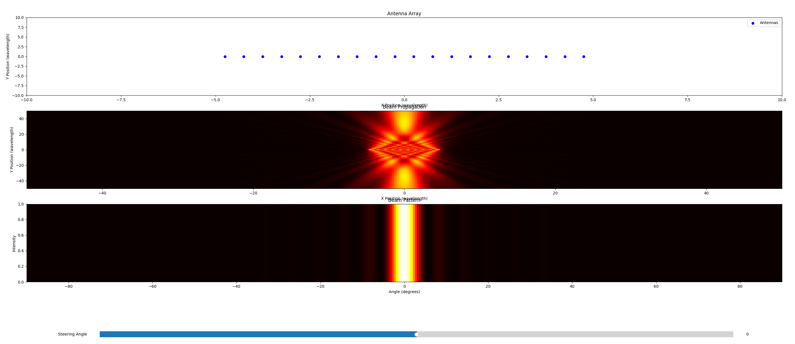
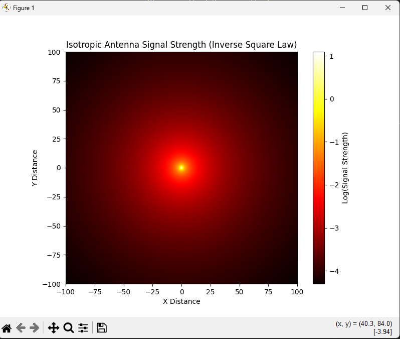

# SignalForge
<p>


</p>
SignalForge is a Python simulation tool designed for antenna array beamforming and evolutionary optimization experiments. It allows users to model, visualize, and optimize antenna arrays for signal propagation.

## Files

1. **Evolutionary_V1.py**: Includes both the simulation and an evolutionary algorithm. Note: the evolutionary algorithm is experimental and may not function optimally.
2. **Working_Sim.py**: Focused solely on simulation. Provides reliable and accurate antenna array simulations.

## Features

- Add and visualize custom antenna arrays.
- Simulate beam propagation and generate radiation patterns.
- Experimental evolutionary optimization for antenna placement.

## Requirements

- Python 3.7 or higher
- NumPy
- Matplotlib

## Installation

1. Clone the repository:
   ```bash
   git clone https://github.com/TheTheoM/SignalForge
   ```
2. Install dependencies:
   ```bash
   pip install numpy matplotlib
   ```

## Usage

Run the simulation script:
```bash
python Working_Sim.py
```
For experiments with the evolutionary algorithm, run:
```bash
python Evolutionary_V1.py
```
